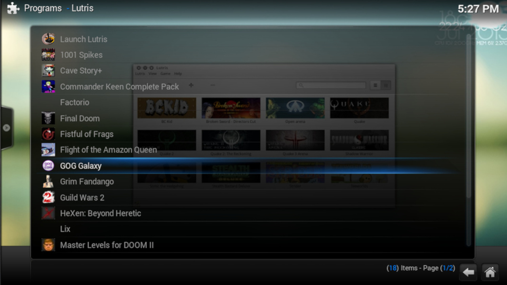

# Lutris Kodi Addon

[Kodi](http://kodi.tv) add-on to launch games through [Lutris](http://lutris.net).



## Features

- Display games managed by Lutris in Kodi
- Launch games using Lutris from Kodi

## Prerequisites

- [Install and setup Lutris](https://lutris.net/downloads/)

## Install from repository (Matrix)

1. Make sure that Unknown Sources is enabled in Settings → System → Add-ons

2. [Install solbero's Kodi add-on repository](https://github.com/solbero/repository.solbero.matrix/blob/master/README.md)

3. Visit Home → Settings → Add-ons → Install from repository → solbero’s Kodi add-on repository → Game add-ons → Game providers → Lutris → Install

## Install from repository (Leia)

1. Make sure that Unknown Sources is enabled in Settings → System → Add-ons

2. [Install solbero's Kodi add-on repository](https://github.com/solbero/repository.solbero/blob/master/README.md)

3. Visit Home → Settings → Add-ons → Install from repository → solbero’s Kodi add-on repository → Game add-ons → Game providers → Lutris → Install

## Install manually (Matrix)

1. [Download the latest version of the Lutris Kodi Addon](https://github.com/RobLoach/lutris-kodi-addon/releases/latest)

2. Go to Settings → Add-ons → Install from zip file

3. Navigate to where you placed the zip file and select Install

## Development

```bash
git clone git@github.com:RobLoach/lutris-kodi-addon.git ~/.kodi/addons/plugin.lutris
cd ~/.kodi/addons/plugin.lutris
git status
```

## About

- [Rob Loach](http://github.com/RobLoach)
- [solbero](https://github.com/solbero)
- [Source](https://github.com/RobLoach/lutris-kodi-addon)
